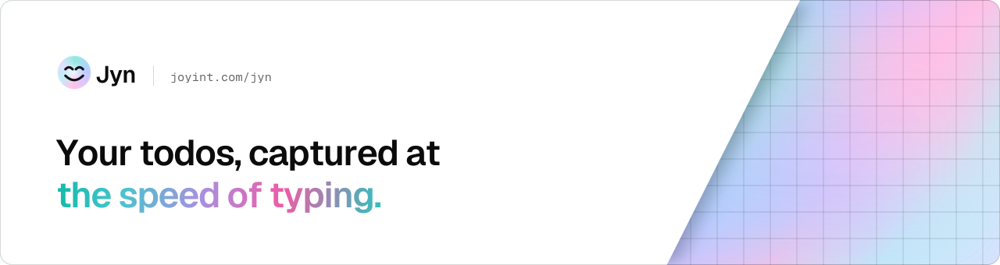
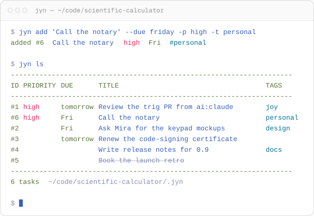

<p align="center">
  <a href="https://joyint.com/jyn/"><picture>
    <source media="(prefers-color-scheme: dark)" srcset="docs/assets/banner-dark.svg">
    
  </picture></a>
</p>

<p align="center">
  <a href="https://github.com/joyint/jyn/releases/latest"></a>
  <a href="https://crates.io/crates/jyn-cli"></a>
  <a href="https://github.com/joyint/jyn/actions/workflows/ci.yaml"></a>
  <a href="./LICENSE"></a>
</p>

<p align="center">
  <a href="https://joyint.com/jyn/">Website</a> ·
  <a href="https://joyint.com/jyn/docs/">Docs</a> ·
  <a href="#install">Install</a> ·
  <a href="#quick-start">Quick start</a> ·
  <a href="docs/user/Tutorial.md">Tutorial</a>
</p>

# Jyn

**A fast personal task manager for the terminal.**

Jyn captures a todo in one command and keeps it as a plain YAML file in `.jyn/`, next to whatever you are working on. Due dates, tags, five priority levels and recurring series, with no account, no server and nothing to configure. Jyn is the personal companion to [Joy](https://github.com/joyint/joy) and shares its data model.

<p align="center">
  <picture>
    <source media="(prefers-color-scheme: dark)" srcset="docs/assets/demo-dark.svg">
    
  </picture>
</p>

## Why Jyn

- **Capture without thinking.** `jyn add` and a title, quotes only where the shell needs them. Structure is optional and can come later.
- **Due dates the way you say them.** `today`, `tomorrow`, `fri`, `next monday`, `+3d`, `2w` or a calendar date.
- **Recurring tasks in plain words.** `--recur "every Monday"` or `"monthly on the 1st"`. Jyn stores it as an iCalendar rule (RFC 5545), and closing an occurrence rolls the task forward to the next one.
- **A list that knows what is next.** The default order combines urgency and priority; `--sort` and filters by tag or due date are there when you want them.
- **Plain files you own.** One YAML file per task in `.jyn/items/`. Read, grep and version them like anything else in your repository.

## Install

macOS / Linux:

```sh
curl -fsSL get.joyint.com/jyn | sh
```

Windows:

```powershell
winget install -s winget joyint.jyn
```

From source:

```sh
cargo install jyn-cli
```

Windows without winget:

```powershell
irm get.joyint.com/jyn.ps1 | iex
```

## Quick start

```sh
jyn add Review the deploy script
jyn add "Fix broken pipeline" --priority high --tag work
jyn add "Reply to the RFC" --due fri
jyn add "Standup" --due 2026-04-13 --recur "every Monday"

jyn                  # open tasks, smart order
jyn ls --due today   # due today or overdue
jyn done 1           # close a task by the number the list shows
```

The first `jyn add` creates a `.jyn/` directory where you are. After that, jyn finds it the way Git finds a repository: from any subdirectory, walking upward. Every listing names the active `.jyn/` in its footer.

`jyn tutorial` covers the rest: editing, archiving, assigning, sorting and configuration.

## Documentation

- [Tutorial](docs/user/Tutorial.md) - the full walk-through, also available as `jyn tutorial`
- [VISION.md](./VISION.md) - product vision
- [ARCHITECTURE.md](./ARCHITECTURE.md) - technical overview
- [CONTRIBUTING.md](./CONTRIBUTING.md) - conventions, testing, release

More on [joyint.com/jyn/docs](https://joyint.com/jyn/docs/):

- [Features](https://joyint.com/jyn/docs/features/) - what Jyn can do today and what is planned
- [Use cases](https://joyint.com/jyn/docs/use-cases/) - how people use Jyn for personal task management
- [Applications](https://joyint.com/jyn/docs/applications/) - the CLI today, with TUI, mobile and CalDAV sync planned

## Status

Jyn is pre-1.0 and under active development. The CLI is what exists today; sync with calendar apps over CalDAV is planned and not part of it yet.

Jyn is part of the [Joyint](https://github.com/joyint) ecosystem. Website: [joyint.com/jyn](https://joyint.com/jyn/).

## License

MIT. See [LICENSE](./LICENSE).
