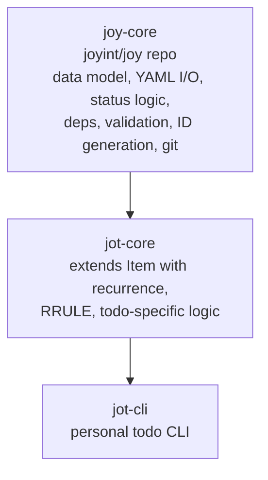

# Jot -- Architecture

This document defines the technical foundation for the Jot repository. It covers technology choices, repository structure, and crate layout.

For product vision and CLI design see [Vision.md](./Vision.md). For coding conventions, testing, and CI/CD see [CONTRIBUTING.md](../../CONTRIBUTING.md). For cross-project architecture and ADRs see the [umbrella repository](https://github.com/joyint/project).

---

## Technology Stack

Jot uses the same Rust toolchain and dependency versions as [Joy](https://github.com/joyint/joy/blob/main/docs/dev/Architecture.md#technology-stack). Key dependencies:

| Component                    | Version              | Rationale                                                         |
| ---------------------------- | -------------------- | ----------------------------------------------------------------- |
| **Rust**                     | 1.85 (latest stable) | Performance, single binary, type safety, memory safety            |
| **clap** (derive API)        | 4.5                  | CLI standard, shell completions                                   |
| **serde** + **serde_yml**    | 1.0 / 0.0.12         | YAML for `.jot/` files                                            |
| **thiserror**                | 2.0                  | Explicit error types in jot-core                                  |
| **anyhow**                   | 1.0                  | Convenient error handling in jot-cli                              |
| **insta**                    | 1.41                 | Snapshot testing                                                  |

---

## Relationship to joy-core

`jot-core` depends on `joy-core` as an external crate (published on crates.io or referenced via git dependency). It extends `joy-core::Item` with recurrence support while inheriting the full base data model, YAML I/O, status logic, and Git integration.



---

## Repository Structure

```
jot/
├── Cargo.toml                  # Workspace root
├── Cargo.lock
├── LICENSE                     # MIT license
├── CONTRIBUTING.md             # Coding conventions, testing, CI/CD
├── README.md
├── docs/
│   └── dev/
│       ├── Vision.md           # Product vision, CLI design
│       └── Architecture.md     # This file
├── crates/
│   ├── jot-core/               # Todo extension: recurrence, RRULE (MIT)
│   │   ├── Cargo.toml          # Depends on joy-core
│   │   └── src/
│   └── jot-cli/                # Personal todo CLI binary (MIT)
│       ├── Cargo.toml          # Depends on jot-core
│       └── src/
│           ├── main.rs
│           └── commands/       # One module per command (add, done, ls, show, edit, rm)
├── tests/                      # Integration tests
│   ├── cli/                    # CLI integration tests
│   └── fixtures/               # Test data (.jot/ directories)
├── .github/
│   └── workflows/              # CI/CD
├── .claude/                    # Claude Code context
│   └── CLAUDE.md
└── justfile                    # Task runner (just)
```

---

## Cargo Workspace

```toml
# Cargo.toml (workspace root)
[workspace]
resolver = "2"
members = [
    "crates/jot-core",
    "crates/jot-cli",
]

[workspace.dependencies]
serde = { version = "1.0", features = ["derive"] }
serde_yml = "0.0.12"
thiserror = "2.0"
anyhow = "1.0"
clap = { version = "4.5", features = ["derive"] }
```

---

## Licensing

Both crates (`jot-core`, `jot-cli`) are MIT-licensed. See [ADR-008](https://github.com/joyint/project/blob/main/docs/dev/adr/ADR-008-open-core-licensing.md) for the open-core licensing rationale.

---

## Architecture Decision Records

ADRs are maintained in the [umbrella repository](https://github.com/joyint/project/tree/main/docs/dev/adr). Key ADRs relevant to Jot:

- [ADR-001: YAML over SQLite for data storage](https://github.com/joyint/project/blob/main/docs/dev/adr/ADR-001-yaml-over-sqlite.md)
- [ADR-005: Package name `joyint`, binary name `joy`](https://github.com/joyint/project/blob/main/docs/dev/adr/ADR-005-package-name-joyint.md)
- [ADR-008: Open Core Licensing Model](https://github.com/joyint/project/blob/main/docs/dev/adr/ADR-008-open-core-licensing.md)
