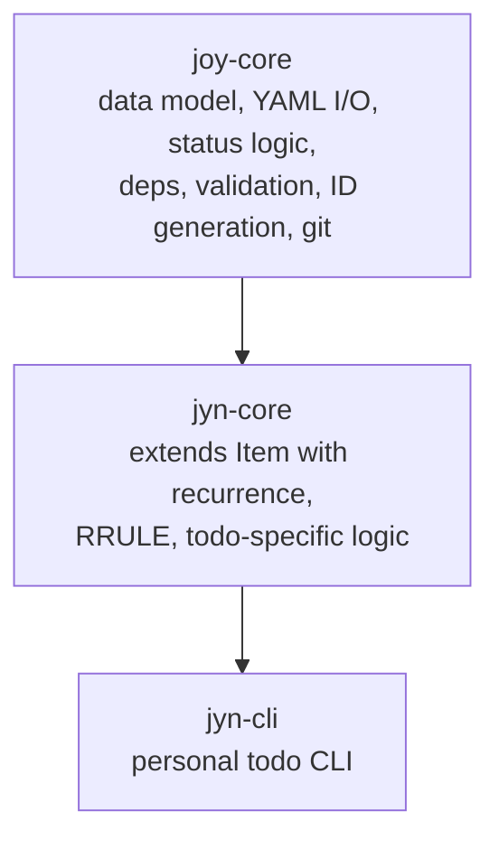

# Jyn -- Architecture

This document defines the technical foundation for the Jyn repository. It covers technology choices, repository structure, crate layout, and key design decisions.

For product vision and CLI design see [Vision.md](./Vision.md). For coding conventions, testing, and CI/CD see [CONTRIBUTING.md](../../CONTRIBUTING.md).

---

## Technology Stack

| Component                    | Version              | Rationale                                                         |
| ---------------------------- | -------------------- | ----------------------------------------------------------------- |
| **Rust**                     | 1.85 (latest stable) | Performance, single binary, type safety, memory safety            |
| **clap** (derive API)        | 4.5                  | CLI standard, shell completions                                   |
| **serde** + **serde_yml**    | 1.0 / 0.0.12         | YAML for `.jyn/` files                                            |
| **thiserror**                | 2.0                  | Explicit error types in jyn-core                                  |
| **anyhow**                   | 1.0                  | Convenient error handling in jyn-cli                              |
| **insta**                    | 1.41                 | Snapshot testing                                                  |
| **rrule**                    | latest               | RRULE parsing and next-occurrence computation                     |

---

## Relationship to joy-core

`jyn-core` depends on `joy-core` as a crates.io dependency. It extends `joy-core::Item` with recurrence support via `serde(flatten)` while inheriting the full base data model, YAML I/O, status logic, and Git integration.



### Dependency strategy

`jyn-core` declares a crates.io dependency on joy-core with a compatible minor version (e.g., `joy-core = "0.5"`). Any `0.5.x` patch release is picked up automatically. A minor bump (0.6) requires an explicit update in jyn-core.

For local development alongside joy-core, a Cargo `paths` override can redirect to a local checkout:

```toml
# .cargo/config.toml (in a parent directory or workspace)
paths = ["../joy/crates/joy-core"]
```

External builders who clone only the jyn repo get the crates.io version -- no additional setup required.

---

## Recurrence (RRULE)

Jyn supports recurring todos via the iCalendar RRULE standard (RFC 5545). This ensures compatibility with CalDAV clients (Apple Reminders, Google Calendar, Thunderbird) without format conversion.

```yaml
title: Team Standup
due_date: '2026-03-19T09:00:00'
recurrence: 'FREQ=WEEKLY;BYDAY=MO,TU,WE,TH,FR'
```

The `rrule` Rust crate parses RRULE strings and computes next occurrence dates, handling time zones, DST transitions, and leap years. jyn-core uses it to calculate the next `due_date` when a recurring todo is completed.

Common patterns:

| Pattern | RRULE |
|---------|-------|
| Every day | `FREQ=DAILY` |
| Every weekday | `FREQ=WEEKLY;BYDAY=MO,TU,WE,TH,FR` |
| Every 2 weeks | `FREQ=WEEKLY;INTERVAL=2` |
| First of every month | `FREQ=MONTHLY;BYMONTHDAY=1` |
| Every year | `FREQ=YEARLY` |

---

## Repository Structure

```
jyn/
├── Cargo.toml                  # Workspace root
├── Cargo.lock
├── LICENSE                     # MIT license
├── CONTRIBUTING.md             # Coding conventions, testing, CI/CD
├── README.md
├── docs/
│   └── dev/
│       ├── Vision.md           # Product vision, CLI design
│       └── Architecture.md     # This file
├── crates/
│   ├── jyn-core/               # Todo extension: recurrence, RRULE (MIT)
│   │   ├── Cargo.toml          # Depends on joy-core
│   │   └── src/
│   └── jyn-cli/                # Personal todo CLI binary (MIT)
│       ├── Cargo.toml          # Depends on jyn-core
│       └── src/
│           ├── main.rs
│           └── commands/       # One module per command (add, done, ls, show, edit, rm)
├── tests/                      # Integration tests
│   ├── cli/                    # CLI integration tests
│   └── fixtures/               # Test data (.jyn/ directories)
├── .joy/                       # Product backlog (managed by joy CLI)
├── .github/
│   └── workflows/              # CI/CD
├── .claude/                    # Claude Code context
│   └── CLAUDE.md
└── justfile                    # Task runner (just)
```

---

## Cargo Workspace

```toml
# Cargo.toml (workspace root)
[workspace]
resolver = "2"
members = [
    "crates/jyn-core",
    "crates/jyn-cli",
]

[workspace.dependencies]
serde = { version = "1.0", features = ["derive"] }
serde_yml = "0.0.12"
thiserror = "2.0"
anyhow = "1.0"
clap = { version = "4.5", features = ["derive"] }
```

---

## Data Format

### YAML storage

All data lives in `.jyn/items/*.yaml` files, one file per todo. The format follows the same conventions as joy-core items (see [ADR-001](https://github.com/joyint/project/blob/main/docs/dev/adr/ADR-001-yaml-over-sqlite.md) for rationale). Files are human-readable, diffable, and mergeable with standard Git tools.

### YAML schema evolution

The `.jyn/config.yaml` contains a `version` field (currently `1`). Schema evolution rules:

- **New fields** are always optional with sensible defaults. Old files work without migration.
- **Fields are never renamed or removed**, only deprecated and ignored.
- **Incompatible schema changes** increment the version. Jyn detects the old version, migrates automatically on the next write, and updates the version field.
- **Newer format, older tool**: if Jyn encounters a version higher than it understands, it refuses to operate with a clear error message suggesting an update.

---

## Configuration

Jyn has its own config layer, implemented in `jyn-core::config`. It is deliberately independent of `joy-core::model::Config` because jyn has a much smaller settings surface -- duplicating the struct is cheaper than importing and narrowing joy's.

### Files and merge order

Two optional YAML files, merged lowest-precedence first:

| Layer            | Path                                                      | Purpose                                    |
| ---------------- | --------------------------------------------------------- | ------------------------------------------ |
| code defaults    | `Config::default()`                                       | Always present, sets every field           |
| personal global  | `$XDG_CONFIG_HOME/jyn/config.yaml` (else `~/.config/...`) | Per-user preference across all projects    |
| project-local    | `<cwd>/.jyn/config.yaml`                                  | Per-project override, committable          |

The local layer follows jyn's task model: it is scoped to cwd, not walked up the directory tree. `jyn ls` in a subdirectory sees different tasks than `jyn ls` one level up, and config follows the same rule for consistency.

### Strict schema

Both `Config` and `OutputConfig` carry `#[serde(deny_unknown_fields)]`. Combined with the validate-before-write path in `jyn config set` (YAML round-trip through the typed Config after merging with defaults), typos like `outpt.fortune` are rejected at set time with a schema-derived hint. Integrators who need to carry arbitrary extension keys should extend the struct rather than rely on serde tolerance.

### CLI

`jyn config` exposes read, list, and write operations. Write targets are resolved in this order:

1. explicit `--global` or `--local` flag wins,
2. else if `.jyn/` exists in cwd, write local,
3. else if the global file already exists, write global,
4. else fail with an actionable message listing both flags.

Step 4 is deliberate. Auto-creating a `.jyn/` on first `jyn config set` from a random directory (e.g. `$HOME`) would leave a surprising project marker behind; forcing the explicit flag once is a small cost for clarity.

### joy-core integration

The first consumer is the `joy_core::fortune::fortune(...)` call in `jyn-cli::main`. The fortune function itself is pure and ungated inside joy-core; jyn-cli owns the gate via `config.output.fortune` (bool) and `config.output.fortune_category` (optional `joy_core::fortune::Category`). No changes to joy-core were required, and no joy-core version bump: the integration is a caller-side decision, as it should be for library-level easter-egg features.

---

## Performance Targets

- `jyn add`: <100ms (quick capture must feel instant)
- `jyn ls`: <30ms for unfiltered list
- `jyn done`: <100ms including recurrence calculation
- Recurrence computation: <10ms for 100 recurring todos
- Binary size: <5MB

Performance targets are enforced by timing assertions in CI tests.

---

## Licensing

Both crates (`jyn-core`, `jyn-cli`) are MIT-licensed. Every source file carries an SPDX license header.

---

## Key Design Decisions

Architectural decisions that affect Jyn are documented as ADRs. The most relevant ones:

- [ADR-001: YAML over SQLite for data storage](https://github.com/joyint/project/blob/main/docs/dev/adr/ADR-001-yaml-over-sqlite.md)
- [ADR-008: Open Core Licensing Model](https://github.com/joyint/project/blob/main/docs/dev/adr/ADR-008-open-core-licensing.md)
- [ADR-010: VCS abstraction layer](https://github.com/joyint/project/blob/main/docs/dev/adr/ADR-010-vcs-abstraction.md)
- [ADR-011: YAML-aware merge strategy for conflict resolution](https://github.com/joyint/project/blob/main/docs/dev/adr/ADR-011-yaml-aware-merge-strategy.md)

The full list of ADRs is maintained in the [Joyint project repository](https://github.com/joyint/project/tree/main/docs/dev/adr).
